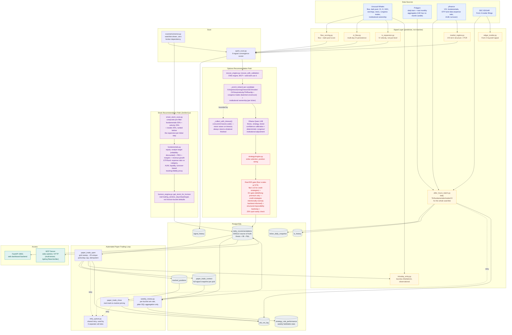
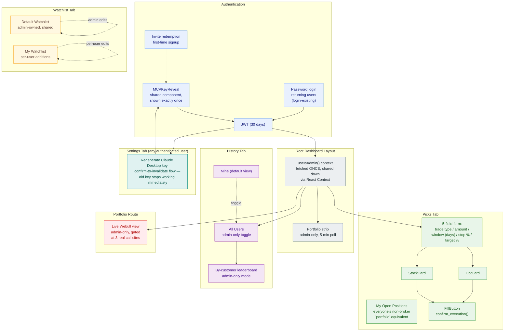

# Trading Intelligence Platform - Architecture

Last updated: July 2026

---

## System Overview

```
User (Claude Desktop / StockBros Browser)
    |
    |-- Claude Desktop --> MCP Server
    |     stdio: local admin usage, one process per user (unchanged)
    |     HTTP (MCP_TRANSPORT=http): hosted, one shared process serving
    |       many customers - each request authenticated independently
    |       via ApiKeyTokenVerifier (app/mcp_server/auth.py) against
    |       user_api_keys, resolved fresh per call, never cached across
    |       customers - see "Multi-User / MCP Access Notes" below
    |
    |-- Browser --> FastAPI :8001 --+
                                    |
                    +---------------v------------------+
                    |         Core Engine               |
                    |                                   |
                    |  Scanner -> Rescan/Smart Engine    |
                    |          -> LLM -> Trade Math      |
                    |                                   |
                    |  Data: UW + Polygon + yfinance    |
                    +---------------+-------------------+
                                    |
                    +---------------v------------------+
                    |           PostgreSQL              |
                    |     (Docker, localhost:5432)      |
                    +-----------------------------------+
```

Broker connection (Webull) is used only for the admin's own live
portfolio, positions, and orders - the scanner and recommendation
engine do not depend on it. See "Watchlist Architecture" below.

Full backend data-flow diagram, including the options and stock
recommendation paths side by side and where each trade-math gate
applies: `docs/diagrams/backend-architecture.mermaid` (rendered below).
Frontend component/auth diagram: `docs/diagrams/frontend-architecture.mermaid`,
rendered in "StockBros Dashboard" below.



---

## Data Flow - Options Recommendation Run

Single engine for both channels - the MCP tool get_daily_recommendations
and the web dashboard's "Scan" button both call
rescan_engine.py::rescan_with_validation() directly, no separate
MCP-only scoring path. (An earlier version of this doc described
daily_engine.py as a "fallback path if the smart engine fails" - that
was never true for MCP, which called it unconditionally as its only
engine, and the one place on the web side that *did* fall back to it
was itself dead code, always throwing before reaching rescan_engine at
all - see REMAINING_ITEMS.md.) The two features daily_engine's old scan
had that rescan_engine lacked - portfolio-position exclusion from new
BUY candidates, and a pre-flight API health check - are now inside
rescan_with_validation() itself.

```
Trigger (dashboard "Scan" button, MCP get_daily_recommendations, or scheduled)
    |
    |-- Pre-fetch (shared, once):
    |     VIX + market regime (VIX term structure, put/call ratio)
    |     Global news, earnings calendar
    |     Batch flow alerts + dark pool (UW, limit=500 each)
    |
    |-- Scanner (watchlist-sized universe, ~130 tickers):
    |     Polygon grouped_daily (1 call) or live Webull prices
    |     Flow/dark pool scoring (shared flow_scoring.py module)
    |     OI buildup signal (from cached signal_history - zero
    |       added API cost per scan)
    |     5-signal convergence + conflict detection
    |     -> Top 15 picks
    |
    |-- Enrich candidates (parallel, 6-8 threads):
    |     IV rank, expiries, news, TA, GEX, insider activity,
    |     OI buildup, velocity - per ticker
    |
    |-- Single LLM call (Ollama Qwen 14B):
    |     Compressed ticker contexts + market regime + VIX +
    |     news + strategy-selection rules based on conditions
    |     LLM decides: ticker + expiry + strategy + strikes
    |
    |-- Deterministic trade math:
    |     Validate strikes vs real UW contracts
    |     Real risk/reward gate (actual max-gain/max-loss, not a
    |       constant ratio)
    |     Probability-adjusted EV gate (debit/long-premium
    |       strategies only - see "Trade Math Gates" below)
    |     Position sizing, sanity cap ($50K/contract hard ceiling)
    |
    +-- Store + Alert:
          daily_recommendations table
          Discord notification if act_now=True

Total: 60-80s (LLM call is the majority; grew from an earlier ~26s
baseline as enrichment depth increased)
```

---

## Watchlist Architecture

No separate "default watchlist" table. user_watchlist is the single
source of truth for every user, distinguished by a users.is_admin
flag:

```
get_scan_universe(user_id, watchlist_mode):
    base = user_watchlist rows belonging to whichever user has
           is_admin = TRUE   (the shared default universe)
    if watchlist_mode == "default_plus_mine":
        base |= this user's OWN user_watchlist rows
    return base
```

For the admin, "default" and "mine" are the same rows - no
special-casing needed anywhere. No hardcoded fallback ticker list
exists anywhere in the scanning pipeline; if the admin's watchlist is
ever empty, the result is an honest empty list, not a silent
substitute.

watchlist_sync.py mirrors a connected broker's live watchlist INTO
user_watchlist as a convenience (add-only - it no longer deletes
anything from the DB that's missing from the broker side, a real bug
fixed this session).

---

## Trade Math Gates

Two independent checks run inside strategy/engine.py's
_execute_trade_math(), both able to reject a candidate strike
selection and trigger a fallback:

1. Real risk/reward gate

```
real_risk_reward = credit_received / margin_required   (credit)
                  = (max_profit * n) / premium_paid      (debit)
```

Thresholds scale by horizon (0.5 debit / 0.15 credit for 1-week,
loosening for longer horizons). Replaced an earlier version that
checked a constant ratio independent of actual strikes.

2. Probability-adjusted EV gate (debit/long-premium strategies only:
NAKED_CALL/PUT, DEBIT spreads, STRADDLE, STRANGLE)

Uses BSM N(d2) as a probability-of-profit estimate, combined with
max gain/loss into a simple bimodal expected value. Deliberately NOT
applied to credit strategies (iron condor etc.) - an N(d2) estimate
using the same IV used to price the trade is known to be
systematically pessimistic for premium-selling strategies, since it
can't see the volatility risk premium that's the actual source of
edge there. pop_estimate/expected_value are computed and returned for
every strategy for visibility, just not hard-gated for credit.

---

## Component Map

```
app/
  api/
    main.py              FastAPI REST wrapper (:8001)
                          Called by StockBros dashboard.
                          Long-running scan endpoints wrapped in
                          run_in_threadpool - without this, the
                          single asyncio event loop blocks on the
                          60-80s synchronous scan and every other
                          request (including progress-bar polling)
                          queues as genuinely unprocessed.

  broker/
    webull_connector.py  Webull OpenAPI client (positions, orders, balance)
    factory.py           Multi-broker abstraction (Webull now; via
                          SnapTrade - Robinhood/IBKR/Tastytrade
                          stubbed, ready for real implementation)
    sell_signals.py      Rule-based exit signals + Discord alert routing
                          (STOP_LOSS and TAKE_PROFIT both fire)
    active_bets.py       Enrich positions with target/stop/status
    watchlist_sync.py    Add-only mirror: broker watchlist -> user_watchlist

  scanner/
    universe.py          get_scan_universe() - database-only, no
                          broker dependency, no hardcoded fallback
    quick_scan.py        5-signal convergence scanner (price
                          momentum, flow, dark pool, TA, OI buildup)
                          with conflict detection between strong
                          signals

  signals/
    flow_scoring.py      Canonical flow/dark-pool scoring - shared
                          module after the same scoring bug was
                          found independently in 5 different files
    oi_flow.py           OI buildup signal - multi-day institutional
                          accumulation, a genuine LEADING indicator
                          (as opposed to same-day flow, which is
                          reactive to a move already in progress)
    market_regime.py     VIX term structure (contango/backwardation)
                          + put/call ratio -> overall market bias
    velocity_tracker.py  Daily signal snapshot + 3-5 day velocity
    edgar_insider.py     SEC EDGAR Form 4 insider activity
    rate_limiter.py      Token bucket for UW API (110/min)

  recommendations/
    rescan_engine.py     Main options entry point - validates
                          morning picks (INTACT/UPDATED/BROKEN),
                          finds new picks, always includes SPY/QQQ
    smart_engine.py      Multi-horizon engine (predecessor to
                          rescan_engine for a fresh, no-morning-
                          picks scan)
    smart_stock_scan.py  Predictive stock scanner - fundamentals +
                          velocity + insider, with a reliability
                          discount on analyst-target upside (thin
                          coverage / wide analyst disagreement /
                          low share price all reduce trust in a
                          raw upside percent - this was the actual
                          mechanism behind picks clustering under $30).
                          Backs both the web's stock-scan branch AND
                          horizon_engine.py::scan_for_horizon's stock
                          horizons (6m/1yr) - previously web-only.
    daily_engine.py      Recommendation storage, lifecycle
                          (invalidation), and formatting - shared by
                          MCP and web. No longer runs its own scan
                          (run_daily_recommendations, scored via
                          conviction.py's older 12-factor system, was
                          retired - see Conviction Scoring below).
    horizon_engine.py    Per-horizon options/stock logic.
                          get_stock_for_horizon() is the single shared
                          recommendation builder for every stock caller
                          (single-ticker tools AND smart_stock_scan.py's
                          Phase 2) - includes the same analyst-target
                          reliability discount as smart_stock_scan.py
                          (fundamentals.py::analyst_target_reliability,
                          shared). scan_for_horizon() delegates stock-
                          horizon watchlist scans to smart_stock_scan.py
                          rather than its own per-ticker loop; options
                          horizons still call get_options_for_horizon()
                          per ticker. Stock universe delegates to
                          scanner.universe.get_scan_universe() rather
                          than a second parallel implementation.
    mark_to_market.py    P&L calculation for every stored
                          recommendation. Credit-strategy P&L% is
                          computed against max_loss (real capital
                          at risk), not credit received - a
                          denominator bug fixed this session that
                          had been inflating iron condor returns.
                          calculate_backtest_stats() excludes rows
                          flagged excluded_from_stats.
    fundamentals.py      yfinance fundamentals + analyst targets for
                          equities. analyst_target_reliability() (moved
                          here from smart_stock_scan.py) is the shared
                          reliability discount used by both
                          smart_stock_scan.py's ranking and
                          horizon_engine.py's target_price.
                          get_fund_data()/score_etf_fundamentals() are
                          the fund-appropriate equivalent for ETFs
                          (expense ratio vs category, AUM, liquidity,
                          turnover-based tracking-fidelity proxy) -
                          replaces an older technicals-only stand-in
                          that scored every ETF almost identically
                          regardless of fund quality, and fixed a real
                          bug where ETFs were being silently filtered
                          out of stock recommendations entirely by the
                          equity rubric's near-zero placeholder scoring.

  strategy/
    engine.py            Trade math: strike selection, cost, R:R,
                          probability-adjusted EV, $50K/contract
                          sanity cap, unified strategy naming
                          (STRATEGY_ALIASES / normalize_strategy())

  options_flow/
    unusual_whales.py    All UW API calls, including OI-change
                          (get_oi_change) added this session

  learning/
    nightly_loop.py      Runs after mark_all_active_recommendations
                          in the same scheduled job (4:30 PM ET) -
                          previously mark-to-market only ran lazily
                          when the History tab loaded, so nightly
                          learning could run against stale/unmarked
                          data
    prediction_tracker.py confirm_execution()/log_outcome() write
                          real fill data directly onto the matching
                          daily_recommendations row (ticker + fill-
                          price matched, not just "most recent" -
                          options routinely have multiple live recs
                          for the same ticker same day)
    engine.py            Strategy win-rate analysis, weight adjustments

  monitor/
    position_monitor.py  Polls every 15 min, fires STOP_LOSS and
                          TAKE_PROFIT alerts via broker/sell_signals.py.
                          Auto-resumes on server startup for any
                          user with an active tracked position -
                          previously required manual restart every
                          time the server restarted.

  rag/
    context_builder.py   Builds LLM context (price + IV + macro +
                          news). Direct API calls, not vector
                          retrieval - ChromaDB runs in
                          docker-compose but nothing imports it.

  mcp_server/
    server.py            61 MCP tools - see MCP_TOOLS.md
    auth.py               ApiKeyTokenVerifier - per-request bearer-token
                          verification for HTTP transport (user_api_keys,
                          same hash-and-lookup as the local MCP_API_KEY)

  db/
    session.py           SQLAlchemy session management
    migrations/          Schema migrations - NOTE: several real
                          schema changes this session (daily_recs
                          fill-tracking columns, excluded_from_stats,
                          users.is_admin, strategy_recommendations
                          rename) were applied as ad-hoc SQL, not
                          captured as versioned migration files -
                          see REMAINING_ITEMS.md
```

---

## Database Schema (20 tables)

### Auth & Users

```
users               id, email, display_name, invited_by, is_active,
                    is_admin (NEW - the admin's own user_watchlist rows
                    are the shared default watchlist for every user)
user_profiles       user_id, risk_tolerance, conviction_weights
user_api_keys       user_id, service, encrypted_key
invites             id, invited_by, email, invite_code, status, expires_at
broker_connections  user_id, broker_name, auth_method, snaptrade_user_id,
                    encrypted_tokens, is_active
```

### Watchlist & Config

```
user_watchlist      user_id, ticker, notes, sector, added_at
                    Single source of truth for every user's watchlist.
                    Admin's rows = shared default; each user's own
                    rows = their personal additions.
monitor_config      user_id, is_active, check_interval_seconds, ...
                    (usage not fully confirmed this session)
muted_symbols       user_id, symbol, muted_until
notification_config user_id, discord_webhook, discord_enabled
                    Confirmed per-user isolated - no shared/global
                    webhook fallback anywhere.
```

### Recommendations

```
daily_recommendations  The single source of truth for every
                       recommendation, options and stock:
                       thesis, entry/target/stop, legs, mark-to-market
                       P&L (current_value/pnl/mark_type), backtest
                       exclusion flag (excluded_from_stats,
                       exclusion_reason), and - new this session -
                       real fill tracking: user_executed,
                       actual_entry_price, actual_qty, executed_at,
                       exit_price, exit_reason, closed_at, actual_pnl,
                       actual_pnl_pct, was_correct.

strategy_recommendations_deprecated  RETIRED this session. Was a
                       separate, mostly-empty parallel table for
                       fill/outcome tracking (dollar-based target/stop,
                       not percentage) - every consumer (nightly loop,
                       both backtests, learning engine) migrated to
                       read directly from daily_recommendations
                       instead. Renamed, not dropped, to preserve
                       the handful of historical rows.

sell_recommendations  position_id, ticker, signal_type, trigger_pct
```

### Tracking & Learning

```
tracked_positions   user_id, ticker, entry_price, qty, target_pct,
                    stop_pct, daily_rec_id (FK to daily_recommendations
                    - present in schema, not yet populated by the
                    current fill-tracking flow, which instead matches
                    by ticker + fill-price proximity; a cleaner direct
                    link, noted as a follow-up)
position_alerts     user_id, symbol, alert_type, urgency, message, is_read
signal_history      ticker, date, flow_score, dp_score, oi_score,
                    oi_signal, oi_max_days, velocity_3d, ... - the most
                    actively written table in the system (1500+ rows)
iv_history          ticker, date, atm_iv, avg_iv, contract_count,
                    vix_at_time - intended to back real historical
                    IV-rank/IV-expansion analysis; not yet read anywhere
                    in the current codebase (see REMAINING_ITEMS.md,
                    predictive IV-expansion signal)
learning_log        user_id, ran_at, sell_outcomes_updated,
                    backtest_summary, learning_summary,
                    weights_recalibrated
news_impact_log     ticker, headline, predicted_direction, pnl_5d/30d
portfolio_cache     user_id, positions, balances, cached_at
notification_log    user_id, symbol, alert_type, channel, success, sent_at
```

### Key Relationships

```
users --< broker_connections   (admin only, today)
users --< user_watchlist       (every user; admin's rows = shared default)
users --< daily_recommendations (all recs + fill/outcome tracking)
users --< tracked_positions     (confirmed trades, monitored every 15 min)
daily_recommendations --< tracked_positions (on confirm_execution)
daily_recommendations --< learning_log (aggregate, via nightly loop)
```

---

## Conviction Scoring

recommendations/conviction.py (a standalone 12-factor deterministic
scorer, only ever called by the old daily_engine.py::
run_daily_recommendations() scan path) was deleted this session - zero
remaining importers confirmed via repo-wide grep before removal. It was
never unified with quick_scan.py's convergence scanner, which both MCP
and web share via rescan_engine.py/smart_engine.py.

conviction_score today IS the LLM's own confidence field from its
single batched JSON response (see "Data Flow - Options Recommendation
Run" and the backend diagram above) - there is no separate
deterministic conviction step anymore. Two things now shape that
number instead of a 12-factor formula:
  1. A tiered calibration rubric in the LLM prompt itself (explicit
     confidence bands tied to how many signals align, replacing an
     earlier literal `"confidence": 72` example that was silently
     anchoring every response to the same number regardless of real
     signal strength).
  2. A small deterministic +/-15 adjustment applied AFTER the LLM
     call, based on congress trades + institutional ownership actually
     agreeing or conflicting with the chosen direction - added because
     prompt-only calibration reliably moved confidence for broad
     multi-signal swings but did not reliably move it for this
     specific signal pair in isolation, confirmed across repeated live
     tests.

---

## Integration Endpoints

### Unusual Whales (paid, 120 req/min, 20K/day)

```
/api/stock/{ticker}/ohlc/{size}           Daily/intraday OHLC bars
/api/stock/{ticker}/stock-state           Live price including pre/post market
/api/stock/{ticker}/iv-rank               Real 1-year IV rank
/api/stock/{ticker}/expiry-breakdown      Available expiry dates
/api/stock/{ticker}/option-contracts      Options chain with IV
/api/stock/{ticker}/greek-exposure        GEX by strike
/api/stock/{ticker}/greek-flow            Call vs put gamma direction
/api/stock/{ticker}/net-prem-ticks        Call vs put net premium
/api/stock/{ticker}/oi-change             OI buildup - multi-day
                                          institutional accumulation
                                          (added this session)
/api/option-trades/flow-alerts            Unusual sweeps (batch, all tickers)
/api/darkpool/recent                      Dark pool prints (batch, all tickers)
/api/darkpool/{ticker}                    Per-ticker dark pool
/api/institution/{ticker}/ownership       Institutional ownership pct
/api/etfs/{ticker}/in-outflow             Sector ETF money flow
/api/earnings/premarket                   Earnings today premarket
/api/earnings/afterhours                  Earnings today after hours
/api/earnings/{ticker}                    Historical earnings + expected move
/api/news/headlines                       News with sentiment
/api/congress/recent-trades               Congressional trades (tool
                                          exists, not yet fed into
                                          conviction scoring or LLM prompt)
/api/insider/{ticker}/ticker-flow         Insider transactions
/api/market/market-tide                   Aggregate market bull/bear
/api/market/total-options-volume          Put/call ratio (market regime)

Not yet used - genuine opportunities, not oversights:
  /api/market/events                      Economic calendar (Fed/CPI/jobs)
  /api/net-flow/expiry                    Net flow by expiration date
```

### Polygon/Massive (free tier)

```
/v2/aggs/grouped/locale/us/market/stocks/{date}  All-ticker daily OHLC (1 call)
```

### Webull OpenAPI (admin only)

```
/v1/account/positions    Open positions
/v1/account/balance      Account balance + net liquidation value
/v1/account/orders       Today's orders
/v1/user/watchlist       Watchlist mirror (add-only, into user_watchlist)
```

---

## Performance Targets

| Operation | Target | Actual |
|---|---|---|
| Scanner (~130 tickers) | under 5s | 2-4s |
| Full options rescan (enrichment + LLM + math) | under 90s | 60-80s |
| Stock scan | under 40s | 20-35s |
| Portfolio load (cached) | under 1s | under 1s |
| Portfolio load (live) | under 5s | 3-5s |
| Alert detection | 15 min | 15 min, auto-resumes on restart |
| End-of-day learning | background, 4:30 PM ET | mark-to-market runs first, same job |

---

## StockBros Dashboard (stockbros repo)

```
Next.js 16 + React 19 + TypeScript + Tailwind v4
Runs on :3000, calls trading-platform FastAPI on :8001

Routes: dashboard, watchlist, history, alerts, learning, portfolio
(more than the single-page layout described in earlier versions of
this doc)

Auth: invite code -> JWT (30 days), custom implementation (no next-auth)

Progress bar during scans reflects real backend stage - fixed a
blocked-event-loop bug this session where long-running scan endpoints
prevented the status-polling endpoint from being served at all during
the scan.
```



---

## Multi-User / MCP Access Notes

get_current_user_id() in utils/current_user.py no longer caches
identity at process/module level. Under HTTP transport it reads the
per-request AccessToken FastMCP resolves via ApiKeyTokenVerifier
(mcp_server/auth.py), which independently verifies each request's
bearer token against user_api_keys - safe for one shared server
process serving many simultaneous customers, each seeing only their
own data. Under stdio (local Claude Desktop) there's no HTTP request
to read from, so it falls back to resolving the local MCP_API_KEY the
same way it always did - still correct since stdio is one process per
user by construction.

Customer MCP keys are minted automatically on account creation (new
user via invite-code signup in /api/auth/login, app/api/main.py) using
the same generate_api_key()/create_api_key() the admin's own key uses,
returned once in plaintext for StockBros to show the customer. A
self-serve regenerate endpoint now exists (StockBros Settings tab ->
regenerateMcpKey()) - old key invalidated immediately, new one shown
once via the same MCPKeyReveal component used at signup. Password-based
login for returning users (login-existing) was added alongside it, so
signup isn't the only way back in.

Transport is chosen via the mcp_transport setting ("stdio" default,
"http" for hosted - MCP_TRANSPORT env var). Going from HTTP-capable
code to an actual reachable hosted server is still open - see
REMAINING_ITEMS.md.