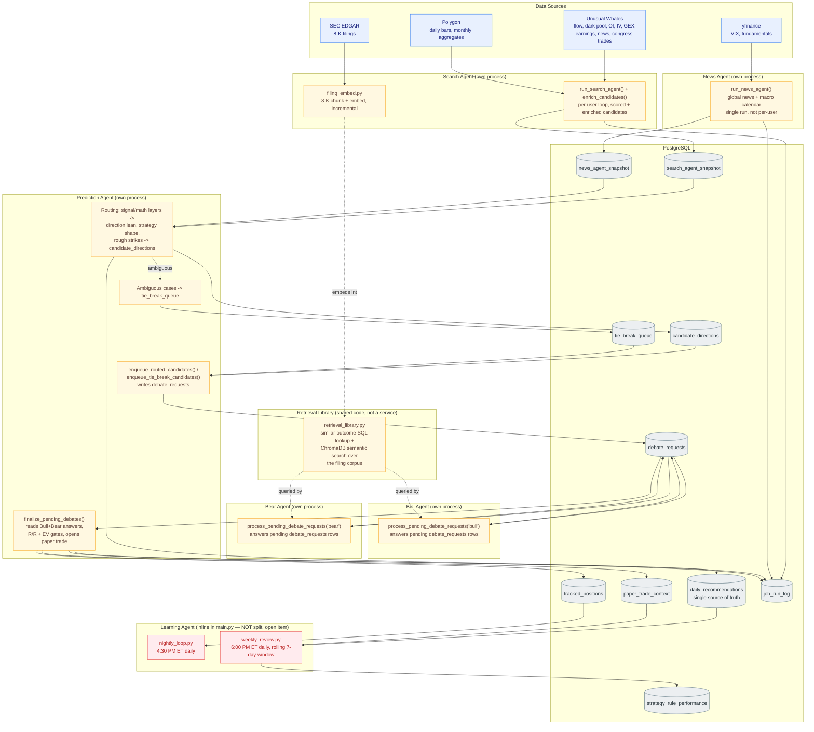

# Trading Intelligence Platform — Architecture

Last updated: 2026-09-02. This is the single canonical architecture + remaining-work
document for the repo, combining the old ARCHITECTURE.md, MULTIAGENT_MIGRATION.md,
REMAINING_ITEMS.md, and the two original June 2026 design PDFs
(`trading_intelligence_platform_design.pdf`, `trading_platform_complete_blueprint.pdf`,
kept for historical reference only). MULTIAGENT_MIGRATION.md and REMAINING_ITEMS.md
were deleted once merged in — update this doc going forward instead. Readme.md stays
a separate, short quickstart/setup guide (not merged in) and points here for design
detail.

**Product focus: options prediction.** The center of gravity is the multi-agent
options-prediction pipeline (Search → News → Prediction routing → Bull/Bear debate →
Finalize → paper-trade open/close → Learning feedback loop). Stock-picking and the
(now-removed) broker/portfolio feature are covered later as secondary/supporting
context — they exist in the codebase but are not the product's focus.

A note on the two source PDFs: both are the original June 2026 pre-implementation
design docs (v1.0 "System Design" and v2.0 "Complete Blueprint"). They describe a
different shape than what got built — Webull-centric portfolio tracking as Phase 1,
Polygon as the primary market-data source, a 12-14 component MCP-only design, 50
hardcoded baseline strategy rules, VPS deployment, SMS/Slack notifications. Almost
none of that survived contact with implementation. What *did* carry through: local
Ollama LLM (cost control), Postgres + ChromaDB, SEC-filing RAG, MCP as an access
path, and the prediction-tracking self-learning loop — all real today, described below
as actually built. Treat the PDFs as historical only; nothing in this document derives
a current-state claim from them without live-code verification.

---

## 1. Product Overview

AI-powered options (and, secondarily, stock) recommendation system. Scans a
user-curated watchlist against real-time market data (options flow, dark pool,
institutional positioning, VIX term structure, SEC filings) and produces specific
options trade recommendations — strategy, strikes, expiry, entry/target/stop — via a
6-agent pipeline, then tracks every recommendation through paper-trade open/close and
feeds outcomes back into a nightly/weekly learning loop.

Stack: Python 3.11, FastAPI, PostgreSQL, ChromaDB, Ollama (local LLM), FastMCP,
Unusual Whales API, Polygon API, yfinance, Next.js dashboard (StockBros, separate repo).

No broker account linking exists anywhere in the system today (removed entirely
2026-08-10 — see §7). The scanner, recommendations, and fill-tracking are 100%
database-driven; a user's own watchlist and their own confirmed fills are the only
inputs, for every user including the former admin.

---

## 2. System Architecture — The Options-Prediction Pipeline

This is the current, *live* architecture, not a future plan. Five of the six agents
(Search, News, Prediction, Bull, Bear) each run as their own standalone OS process
(`app/services/{search,news,prediction,bull,bear}_agent_service.py`), spawned and
supervised directly by the FastAPI process itself — not launchd, not Docker. The sixth
(Learning) is the one exception: it still runs inline in `app/api/main.py`'s embedded
scheduler, not yet split out (open item, §8).



### Agent-by-agent detail

**Search Agent** (`app/services/search_agent_service.py`) — per-active-user loop, two
daily triggers: post-close 4:15 PM ET and pre-open 6:00 AM PT (the second catches
overnight movement; unverified end-to-end with real trading-day output as of the last
audit — see §8). Calls `run_search_agent()` + `enrich_candidates()`
(`app/agents/search_agent.py`, logic unchanged from the old in-process version),
persists the full enriched candidate list to `search_agent_snapshot`. Also owns the
daily filing-embed job (5:00 PM ET, clear of the routing chain) — `filing_embed.py`
chunks and incrementally embeds new 8-K filings into ChromaDB. The transcript half of
this pipeline (earnings-call transcripts) is not built — blocked on Unusual Whales'
enterprise tier (confirmed via live 403 on the transcripts endpoint).

**News Agent** (`app/services/news_agent_service.py`) — single global run (not
per-user; news/macro calendar are the same for everyone), same two fire times as
Search Agent. Calls `run_news_agent()` (`app/agents/news_agent.py`), persists to
`news_agent_snapshot`. Note: the *live-scan-path* callers of
`build_global_news()`/`build_macro_context()` (the still-running legacy
`context_builder.py`/`smart_engine.py`/`rescan_engine.py`) call those functions
directly and synchronously on every request — that's untouched by this split; only the
scheduled snapshot wrapper moved to its own process.

**Prediction Agent** (`app/services/prediction_agent_service.py`) — the one service
that both routes candidates *and* finalizes debates ("both phases" in one process).
Admin-only / single-platform-signal-generation, same principle every paper-trading job
in this codebase follows — it runs exactly once per scheduled fire, never fanned out
per customer.
- **Routing**: deterministic, pre-LLM pass over existing signal/math layers
  (flow_scoring, oi_flow, market_regime, iv_expansion, technical_analysis, R/R and EV
  gates) computes a direction lean, rough strategy shape, and rough strikes per ticker
  → `candidate_directions`. Clear bullish/bearish shape routes to Bull-only or
  Bear-only; genuinely mixed signals go to `tie_break_queue` (tagged with
  `which_rule_conflict_triggered` — which specific signals disagreed).
- **Enqueue**: writes `debate_requests` rows for Bull and/or Bear to answer — this
  table is the *entire* inter-service contract between Prediction and Bull/Bear (no
  direct function calls or imports across the boundary).
- **Finalize**: reads back whatever Bull/Bear answered, re-applies the R/R gate, EV
  gate, and structural-impossibility backstop against their combined output, and opens
  the resulting paper-trade position via the same `confirm_execution()`/
  `DAILY_PICK_CAP` path the old single-process pipeline used.
- Schedule (10-minute buffers between each stage): 16:25 ET / 06:10 PT enqueue-routed
  → 16:35/06:20 Bull/Bear answer window → 16:45/06:30 finalize. Tie-break batch runs
  separately at 08:30 PT enqueue → 08:40 answer → 08:50 finalize — deliberately *after*
  the main pass fully completes, not concurrently (a direct consequence of an earlier
  enrichment-timeout bug from concurrent threads competing for the same rate-limited
  resources). Resolved tie-break picks open at whichever of the existing intraday
  windows comes next — no new time slot, same shared cap.

**Bull Agent / Bear Agent** (`app/services/{bull,bear}_agent_service.py`) — near-
identical: no per-user loop, no admin scoping, just
`process_pending_debate_requests('bull'|'bear')`
(`app/agents/bull_bear_agents.py`), each a focused LLM prompt arguing only its side for
a routed ticker + strategy shape. Checks 10 minutes after each Prediction Agent
enqueue slot, 10 minutes before the matching finalize slot.

**Retrieval Library** (`app/agents/retrieval_library.py`, shared code, not a service)
— two lookup modes Bull/Bear query directly: (1) plain SQL similar-outcome lookup over
`paper_trade_context` + `daily_recommendations`, matched on the same categorical
buckets the weekly review computes; (2) semantic search via ChromaDB against the
filing corpus Search Agent's `filing_embed.py` builds. Bull/Bear only ever *query* an
existing corpus, never build one live.

**Learning Agent** (still inline in `main.py`, not split — open item, §8) —
`nightly_loop.py` (4:30 PM ET daily, after mark-to-market runs first in the same job)
and `weekly_review.py` (6:00 PM ET, **daily** now, not Sunday-only, with a genuine
rolling 7-day window rather than "last completed Mon-Fri" — so a Tuesday run reviews
Wed-Tue). Turns paper-trade outcomes into falsifiable per-bucket win-rate stats
(`strategy_rule_performance`) — every statistic is a plain SQL/Python aggregation; an
LLM call only ever phrases already-computed numbers, never produces one. The
`task_list.md` output never populates a News Agent section — no bucket dimension in
`weekly_review.py` maps findings back to News Agent specifically (open item, §8).

### Cutover history

Until 2026-09-02 (`adec414`), `app/api/main.py`'s scheduler *also* still called the OLD
single-process pipeline (`_run_paper_trade_open_options` → `rescan_engine.
rescan_with_validation` → `smart_engine._execute_smart_rec`) 4x/day, racing the new
pipeline for the same `DAILY_PICK_CAP`/`confirm_execution` sink — while the 5 new
services had never actually run on a real schedule. That old job and its scheduler
registration have been removed entirely; Prediction Agent's finalize step is now the
sole path that opens options positions.

---

## 3. Supporting Systems

### Stock-picking (secondary, legacy-style pipeline — not migrated)

`smart_stock_scan.py` is a separate pipeline from the options multi-agent system above
— predictive stock scanner (fundamentals 50% + velocity 25% + insider 25%, ranked
before an expensive per-ticker step), backing both the web dashboard's stock-scan
branch and `horizon_engine.py`'s stock horizons (6m/1yr). `analyst_target_reliability()`
(`fundamentals.py`) discounts raw analyst-upside percent for thin coverage, wide
analyst disagreement, or low share price — the actual mechanism behind picks
clustering under $30 before the fix. `get_fund_data()`/`score_etf_fundamentals()` are
the fund-appropriate equivalent for ETFs (expense ratio vs category, AUM, liquidity,
turnover-based tracking-fidelity proxy), replacing an older technicals-only stand-in
that silently filtered ETFs out via near-zero placeholder scoring.

Runs directly in `main.py`'s scheduler (`_run_paper_trade_open_stocks`, fires 4x
through the trading day at the same times as the old options job used to, respecting
the same shared `DAILY_PICK_CAP`) — untouched by the multi-agent migration, not an
agent service.

### Position monitoring

`app/monitor/position_monitor.py` polls every 15 minutes, fires `STOP_LOSS` and
`TAKE_PROFIT` alerts via `broker/sell_signals.py` (rule-based exit triggers — trailing
stop, S/R break, RSI, MA crossover). Auto-resumes on server startup for any user with
an active tracked position (previously required a manual restart every time the server
restarted). Real target/stop is tracked per fill (not a hardcoded +20%/-40% default).

`monitor_config` has 3 genuinely dead columns and 4 more that are write-only —
confirmed by reading every reference in `position_monitor.py`: `alerts_muted`/
`muted_until` are real (drive actual mute/unmute behavior). `is_active`/
`last_check_at`/`total_checks`/`total_alerts_fired` are written via `_save_config()`
but nothing ever reads them back — `PositionMonitor.status()` reports in-memory
instance state instead, so this data is invisible after any process restart.
`check_interval_seconds`/`alert_cooldown_minutes` have zero references anywhere.
`last_error` has a column for exactly this purpose but the code tracks it in-memory
only and never passes it to `_save_config()`, so it's permanently NULL. Low priority —
the 2 real columns work fine on their own; this was a "confirm usage" ask, not a
cleanup ask.

### LLM

All agent LLM calls — Bull/Bear debates, Prediction routing narrative, Learning weekly
review, and the legacy `smart_engine`/`strategy/engine.py` paths — run on a **local
Ollama model**, currently `qwen2.5:14b` (`OLLAMA_MODEL` in `.env`, default in
`app/utils/config.py`). Embeddings (filing chunks, retrieval library) use
`nomic-embed-text`, same Ollama host. No hosted/API LLM anywhere in the pipeline
today — the "cloud only for conversation, local for everything else" cost-control
principle from the original design docs is the one piece of that vision that survived
unchanged.

---

## 4. Data Layer

Not a full DDL reference — what each table is for and who touches it. 20+ tables
total; below are the ones load-bearing for the options-prediction pipeline plus a few
supporting tables. `db/migrations/` currently has only 3 files, all from June 2026
(`001_phase1_schema.sql`, `002_watchlist.sql`, `003_sell_recommendations.sql`) —
every schema change since then (multi-agent tables, fill-tracking columns,
`excluded_from_stats`, `users.is_admin`, the `strategy_recommendations` rename, all
paper-trading tables) exists only as ad-hoc SQL run directly against the live DB, not
as versioned migration files. Open item, §8.

| Table | Purpose | Written by | Read by |
|---|---|---|---|
| `search_agent_snapshot` | Full enriched candidate list per run | Search Agent | Prediction Agent routing |
| `news_agent_snapshot` | Global news + macro calendar per run | News Agent | Prediction Agent routing |
| `candidate_directions` | Routed ticker + strategy shape + rough strikes + direction lean | Prediction Agent (routing) | Prediction Agent (enqueue) |
| `tie_break_queue` | Ambiguous candidates, tagged with which signals conflicted | Prediction Agent (routing) | Prediction Agent (enqueue, tie-break slot) |
| `debate_requests` | The entire Prediction ↔ Bull/Bear inter-service contract | Prediction Agent (enqueue), Bull/Bear Agent (answer) | Bull/Bear Agent, Prediction Agent (finalize) |
| `daily_recommendations` | Single source of truth for every recommendation (options + stock): thesis, entry/target/stop, legs, mark-to-market P&L, fill tracking (`user_executed`, `actual_entry_price`, `exit_price`, `was_correct`, ...) | Finalize step, `horizon_engine.py`, fill confirmation | Dashboard, MCP, weekly review |
| `tracked_positions` | Confirmed trades, monitored every 15 min | `confirm_execution()` | Position Monitor, nightly learning |
| `paper_trade_context` | Full signal snapshot at the moment of each pick | Paper-trade open jobs | Weekly review, retrieval library |
| `strategy_rule_performance` | Per-bucket falsifiable win-rate stats | Weekly review | Learning feedback, dashboard |
| `job_run_log` | Scheduled-job execution records | Every scheduled job | Ops/debugging |
| `user_watchlist` | Single source of truth for every user's watchlist; admin's rows = shared default | Watchlist sync, dashboard | Scanner universe (`get_scan_universe`) |
| `users` | `is_admin` flag drives shared-default-watchlist semantics — no other special meaning left now that broker linking is gone | Auth | Everywhere |

`strategy_recommendations` (an older parallel fill/outcome table) was fully retired in
favor of `daily_recommendations` — renamed to `strategy_recommendations_deprecated`
rather than dropped, to preserve the handful of historical rows.

`job_run_log` has no `user_id` column — fine today since paper-trade jobs run once
against the admin account (not looped per user), but any *other* job that still loops
over active users (`after_hours_batch`, `velocity_snapshot`, `nightly_learning`,
`weekly_strategy_review`) produces indistinguishable rows per user if it ever needs the
same kind of forensic reconstruction the paper-trading scheduler investigation
required.

---

## 5. Infrastructure & Operations

**Process supervision**: The 5 split-out agent services are spawned and supervised as
separate OS processes directly by the FastAPI process itself
(`startup_event`/`shutdown_event` in `app/api/main.py`) — not launchd. Launchd-spawned
processes can't access this project's path under `~/Documents` (macOS TCC/Full-Disk-
Access restriction on that folder); the interactively-launched FastAPI process already
can, and children it spawns via `subprocess.Popen` inherit that access. A 5-minute
supervisor job restarts any service that dies; a pre-spawn cleanup step kills stale
orphans on every startup so a `--reload`/redeploy never leaves two sets running at
once. `runbook.sh start`/`stop` start/stop all of it as one unit (stopping the API
stops the 5 services with it). `runbook.sh status` (formerly a separate
`health_check.sh`, merged in) checks real-time process liveness (`ps` pattern match)
plus same-day data freshness once each trigger's fire time has passed.

None of the 5 services are containerized — `docker-compose.yml` only defines
`postgres` and `chromadb` (verified live). They're separate OS processes (communicating
only through Postgres) but coupled to the FastAPI process's lifecycle rather than
independently deployable. Only worth decoupling further if independent deploys/scaling
are actually needed.

**Deployment status**: still local-only. No cloud deployment exists yet (Cloudflare
tunnel or Railway.app — either directly unblocks the hosted MCP server, which is fully
built and tested via `MCP_TRANSPORT=http` + `ApiKeyTokenVerifier` but has nowhere to
run for a real customer). This is priority #1 in the remaining-work list below.

**MCP server**: 59 tools (`app/mcp_server/server.py`, verified via live grep — treat
any other tool-count figure in older docs as stale). Supports `stdio` (local admin,
one process per user, `MCP_TRANSPORT` default) and `http` (hosted, one shared process
serving many customers, each request authenticated independently via
`ApiKeyTokenVerifier` against `user_api_keys`, resolved fresh per call, never cached
across customers). `get_current_user_id()` no longer caches identity at
process/module level under HTTP transport — safe for concurrent multi-customer use.

**Quick start** (adapted from Readme.md, broker env vars removed since they no longer
apply):

```
git clone https://github.com/jpatel30/trading-platform
cd trading-platform
python3 -m venv venv && source venv/bin/activate
pip install -r requirements.txt

docker compose up -d
ollama pull qwen2.5:14b

python3 -m app.db.migrations
```

`.env.example` does not exist in the repo (verified live) — this is part of the
open-source-readiness item below; for now, copy the variable names out of
`app/utils/config.py` directly. Note the migrations gap described in §4 — several
tables/columns exist only as ad-hoc SQL, not in `db/migrations/`.

Seed a watchlist (dashboard's watchlist page, or directly into `user_watchlist`), mark
yourself admin:

```
docker exec trading_postgres psql -U trading -d trading_platform -c "UPDATE users SET is_admin = TRUE WHERE id = (SELECT id FROM users LIMIT 1);"
```

Start the servers — `bash runbook.sh start` brings up Docker, Ollama, MCP, and the
FastAPI process, which in turn spawns and supervises the 5 agent services itself (see
above); `bash runbook.sh stop` tears down the API and all 5 services as one unit.

---

## 6. Architecture Decisions Locked

- Unusual Whales for OHLC bars; Polygon `grouped_daily` for scanner prices; yfinance
  for VIX; **local Ollama for every LLM call, no hosted API** (see §3)
- Separate repos: trading-platform (backend) vs stockbros (frontend)
- FastAPI on :8001; MCP supports `stdio` (local admin) and `http` (hosted,
  multi-customer) via `MCP_TRANSPORT`
- Invite code auth, no OAuth yet
- `user_watchlist` + `is_admin` is the entire watchlist system — no broker dependency
  for scanning, no hardcoded fallback lists anywhere
- `daily_recommendations` is the single source of truth for recommendations AND
  fill/outcome tracking
- `watchlist_sync` is add-only
- One scan engine per job, no fallback to a second implementation — a failure surfaces
  as a real error, never a silent degrade
- **No broker linking for anyone** (removed entirely 2026-08-10, including the former
  admin) — `confirm_execution`/`tracked_positions` is the only way any user's
  fills/positions are recorded, admin included. `webull_connector.py` and
  `BrokerNotConnectedError` were deleted outright, not just gated; no `factory.py`, no
  SnapTrade plumbing exists anywhere in the codebase. (`webull_personal_login.py`/
  `webull_watchlist_api.py` still exist, but only for watchlist *sync* into
  `user_watchlist` — unrelated to account linking or portfolio.)
- Paper-trading (`source='auto_paper'`) is strictly additive to real trades — separate
  dedup rules, separate DB unique index, closed via its own function rather than
  `log_exit()`
- Every weekly-review statistic is a plain SQL/Python aggregation — an LLM call only
  ever phrases already-computed numbers, never produces one
- The multi-agent split (Search/News/Prediction/Bull/Bear) is the current production
  architecture for options recommendations, not a future migration target — the
  migration shipped 2026-09-02

---

## 7. Remaining Work

Merged and deduplicated from MULTIAGENT_MIGRATION.md and REMAINING_ITEMS.md.
Organized by area, not by source file.

### Multi-agent pipeline

- **Learning Agent has no standalone service.** `run_nightly_loop` and
  `run_weekly_strategy_review` are still scheduled directly inside `main.py`'s embedded
  scheduler — never split out like the other 5 agents were.
- **Transcript fetch+chunk+embed pipeline not built** — blocked on Unusual Whales'
  enterprise tier (confirmed via live 403 on the transcripts endpoint). The filing
  (8-K) half is done and verified live (incremental-check logic + real embedded chunks
  in ChromaDB).
- **Search/News Agent pre-open (6 AM PT) triggers unverified end-to-end** — coded
  correctly and now on a real schedule (the cutover fixed the racing-pipeline bug), but
  as of the last audit `search_agent_snapshot`/`news_agent_snapshot` had 0 rows ever
  written by that trigger specifically. Re-check once a weekday pre-open run has
  actually fired and produced data.
- **News Agent section in `task_list.md` output is always empty** — no bucket
  dimension in `weekly_review.py` maps findings back to News Agent specifically, so the
  section is structurally possible but never populates.
- **None of the 5 agent services are containerized** — `docker-compose.yml` only
  defines `postgres`/`chromadb`. Coupled to the FastAPI process's lifecycle rather than
  independently deployable. Only worth decoupling further if independent
  deploys/scaling are actually needed.

### Paper-to-live transition (deferred by design, still open)

- No defined trigger yet for ending the paper-trading validation period (time window,
  confidence threshold from Learning Agent's stats, or explicit manual decision) —
  still undecided.
- No kill-switch exists for the automated paper-trade-open/close jobs. Not urgent while
  still in paper phase.
- `confirm_execution` still hardcodes `source='auto_paper'` at every open site
  (`prediction_agent.py`, `paper_trading.py`). Not yet the sole primary live-fill
  mechanism — correctly deferred until the two items above are resolved.

### Paper-trading calibration (revisit once real market-hours data accumulates)

All of these resolve the same way — once a real week or two of trading-hours data
exists, not before:

- Phase 4 grid sizing (windows/budgets) — untuned, watch `job_run_log` yield over time
- `STOCK_MIN_FUNDAMENTAL=60` — rejected every stock candidate on the one (after-hours)
  night tested; revisit if it recurs on a real trading day
- The 25% spot-sanity threshold — deliberately generous, never tuned against real data
- `iv_trend`'s "+5%" expansion threshold — provisional; not enough `iv_history`
  accumulated yet to populate this field for most tickers
- RSI/MACD/EMA9 entry-timing rule thresholds — standard convention, unvalidated
  against this system's real outcomes
- 5-min vs 15-min comparison — mechanism is live, correctly reported "insufficient
  data" on the first real week's small sample
- `MIN_SAMPLE_SIZE=5`, window-length buckets, the 15-min wrong-entry tiebreak —
  confirmed implemented exactly as specified; the open question is whether they're the
  right numbers, not whether they were built
- Whether paper trades actually use the discussed 40%/50% options / 15%/25% stock
  stop/target defaults — never explicitly re-confirmed
- The -355.6% loss from the first real paper-trading run — very likely a
  BSM-estimate-vs-live-price artifact (pre-market synthetic entry vs a real close
  price); mechanism proven correct, magnitude needs re-checking on a real market-hours
  run
- `job_run_log` has no `user_id` column (see §4 for the forensic-reconstruction
  implication for other still-per-user-looped jobs)

### Frontend cleanup

- The admin-only portfolio strip is still live in
  `stockbros/src/app/dashboard/page.tsx` (gated by `isAdmin`), with a stale comment in
  `layout.tsx` still referencing Webull/`BrokerNotConnectedError` — neither exists on
  the backend anymore. The dedicated `portfolio/page.tsx` route itself is already gone.
  Remove the strip and the stale comment.

### Infrastructure / deployment

- **Deploy somewhere real** (Cloudflare tunnel or Railway.app) — directly unblocks the
  hosted MCP server, which is fully built and tested but has nowhere to run for a real
  customer yet.
- **Point the hosted MCP server at that deployment** once #1 lands.
- **Turn ad-hoc schema changes into versioned migrations** — `db/migrations/` has 3
  files, all from June 2026; everything built since (multi-agent tables, fill-tracking
  columns, `excluded_from_stats`, `users.is_admin`, the `strategy_recommendations`
  rename, all paper-trading tables) is live-DB-only.
- **Open-source readiness sweep** — `.env.example` (confirmed missing), public README
  setup video, a hardcoded-user-ID check across the codebase.

### Smaller / lower-priority

- **`monitor_config`** has 3 genuinely dead columns and 4 more write-only (detail in
  §3) — low priority, the 2 real columns work fine on their own.
- WebSocket real-time dashboard updates
- Mobile push notifications (PWA service worker)
- Public invite page
- Interview talking points (no dependencies, can happen anytime)

---

## 8. Data Quality Notes

Weekend/holiday scanner behavior: flow/dark-pool signals go near-zero, TA/IV rank
still reliable, recommendation quality shifts to momentum+TA only. This is correct,
unchanged behavior, not a bug.

Paper-trading pipeline (all phases): fully built, each piece individually verified,
but every real run so far has happened after-hours against estimated (not live)
prices, with only a small amount of real week-of-outcome data. Treat outcome
*magnitudes* and every "is X predictive" question as unconfirmed until the pipeline
runs start-to-finish across several real market-hours days — the mechanism itself
(signs, scaling, columns, isolation from real trades, honest reporting of insufficient
sample sizes) is already confirmed independent of that.
